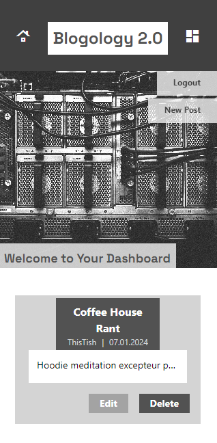
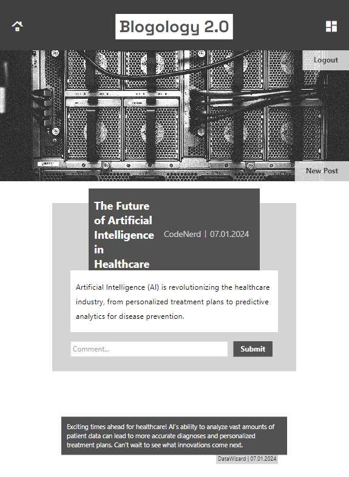
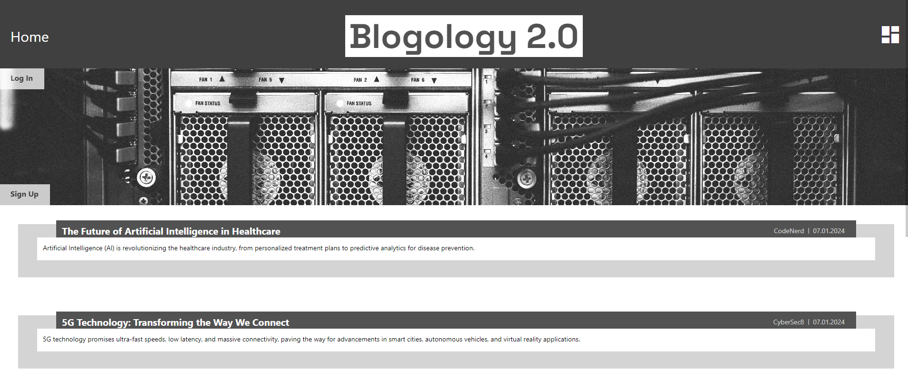

# **Blogology 2.0**


[](https://opensource.org/licenses/MIT)


## 📰 Description

A CMS-style Blog for developers to share their thoughts and comments

## 🔎 Table of Contents

- [Installation](#installation)
- [Usage](#usage)
- [Contributing](#contributing)
- [Tests](#tests)
- [Questions](#questions)
- [License](#license)
- [Preview](#preview)

## 💾 Installation <a id="installation"></a>

Visit the site

## 🖱️ Usage <a id="usage"></a>

### **Welcome to our CMS-style blog site! Here’s a quick guide to help you get started and make the most of it.**

#### Getting Started
```
When you first visit the site, you’ll land on the homepage. Here, you’ll see any blog posts that have already been posted, navigation links to the homepage and the dashboard, and an option to log in or sign up. To gain access to your dashboard, add a post, or post a comment, you must first log in or sign up.
```
#### Signing Up and Logging In

    To get started, you’ll need to sign up by creating a username and password. Just click the sign-up button to save your details and log in. The next time you visit, simply sign in with your username and password.

#### Exploring the Site

    Once you’re logged in, you’ll see buttons for the homepage, the dashboard, add a new post, and an option to log out. On the homepage are all the blog posts with their titles and dates created and the first few lines/words. Click on a post to see its full details, including the title, content, creator’s username, and the date it was posted. You can also leave a comment on posts—just type your comment and hit submit.

#### Using the Dashboard

    In the dashboard, you can see all the posts you’ve created. To add a post, click the button to create a new blog post, enter a title and content, and save it. You’ll be taken back to the dashboard, where your new post will be listed. You can also click on your existing posts to update or delete them.

#### Managing Your Account

    To log out, simply click the logout link in the navigation. If you’re inactive on the site for a while, you’ll still be able to view posts and comments, but you’ll need to log in again to add, update, or delete posts.


## 🌐 Contributing <a id="contributing"></a>


Contact me through my email provided below

## 🧪 Tests <a id="tests"></a>


REST Client for route testing

## ✋ Questions <a id="questions"></a>


If you have any questions, feel free to contact me at:

- *GitHub: [ThisTish](https://github.com/ThisTish)*
- *Contact: tish.sirface@gmail.com*

## 🪪 License <a id="license"></a>

MIT License

        Copyright 2024 Tish Sirface

        Permission is hereby granted, free of charge, to any person obtaining a copy of this software and associated documentation files (the “Software”), to deal in the Software without restriction, including without limitation the rights to use, copy, modify, merge, publish, distribute, sublicense, and/or sell copies of the Software, and to permit persons to whom the Software is furnished to do so, subject to the following conditions:
        
        The above copyright notice and this permission notice shall be included in all copies or substantial portions of the Software.
        
        THE SOFTWARE IS PROVIDED “AS IS”, WITHOUT WARRANTY OF ANY KIND, EXPRESS OR IMPLIED, INCLUDING BUT NOT LIMITED TO THE WARRANTIES OF MERCHANTABILITY, FITNESS FOR A PARTICULAR PURPOSE AND NONINFRINGEMENT. IN NO EVENT SHALL THE AUTHORS OR COPYRIGHT HOLDERS BE LIABLE FOR ANY CLAIM, DAMAGES OR OTHER LIABILITY, WHETHER IN AN ACTION OF CONTRACT, TORT OR OTHERWISE, ARISING FROM, OUT OF OR IN CONNECTION WITH THE SOFTWARE OR THE USE OR OTHER DEALINGS IN THE SOFTWARE.


## 🖼️ Preview <a id="preview"></a>

 

